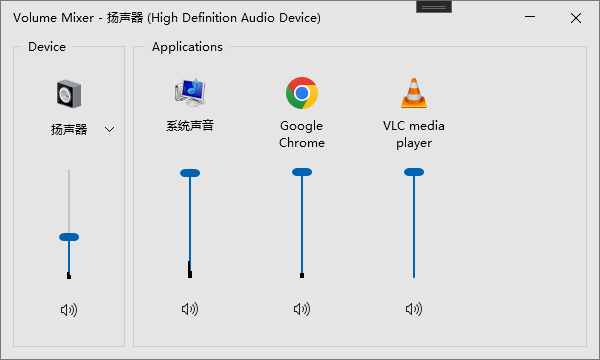

# EarTrumpet

This is a fork version of implementing a classic `sndvol.exe` like volume mixer and building .msi package. All changes are in [this branch](https://github.com/middlered/EarTrumpet/tree/feat-legacy).

Vibing with GPT5.5 in Codex.

